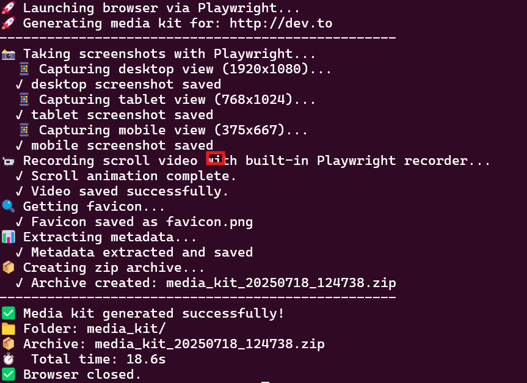

# Modern Website Media Kit Generator

A fast, robust, and self-contained Python CLI tool that generates a comprehensive media kit for any website using Playwright. It captures screenshots, a high-quality scroll video, the website's logo, and metadata, then packages everything into a clean zip file.

This tool is designed to be reliable and easy to use, avoiding the dependency issues of older libraries by using Microsoft's actively maintained Playwright framework.

## Key Features

-   **Reliable Automation**: Built on Playwright for stable, modern browser automation that works headless or headed.
-   **Built-in Video Recording**: Captures a smooth, tab-only scroll video without requiring FFmpeg or other external screen recorders.
-   **Multi-Viewport Screenshots**: Generates screenshots for desktop, tablet, and mobile displays.
-   **Favicon & Metadata**: Automatically finds the best favicon and extracts key metadata (`<title>`, `<meta>`) from the site.
-   **Self-Contained**: After installation, the tool and its required browser binaries are completely self-contained.
-   **Asynchronous**: Uses `asyncio` for efficient, non-blocking operation.

## Requirements

-   Python 3.7+
-   `pip` (Python's package installer)

## Installation

Follow these steps to set up the tool.

**1. Clone the Repository or Download the Script**

Get the `web_media.py` and `requirements.txt` files and place them in a new directory.

```bash
git clone https://github.com/your-username/modern-media-kit-generator.git
cd modern-media-kit-generator
```

**2. Create a Virtual Environment (Recommended)**

This isolates the project's dependencies from your system's Python.

```bash
# For Unix/macOS
python3 -m venv venv
source venv/bin/activate

# For Windows
python -m venv venv
venv\Scripts\activate
```

**3. Install Python Dependencies**

Install the required Python libraries from the `requirements.txt` file.

```bash
pip install -r requirements.txt
```

**4. Install Playwright Browsers**

This is a crucial step. Playwright manages its own browser binaries. This command downloads a version of Chromium that is guaranteed to be compatible with the library.

```bash
python -m playwright install
```

You are now ready to use the tool!

## Usage

Run the script from your terminal, providing the URL of the website.

**Basic Usage:**

```bash
python web_media.py https://github.com
```

**Usage for a Local Project:**

```bash
python web_media.py http://localhost:3000
```

**Usage with a Custom Delay:**

Use the `--delay` flag to wait a few seconds for sites with heavy animations to finish before capturing.

```bash
python web_media.py https://www.apple.com --delay 3```

## Output Structure

The script will generate a `media_kit_<timestamp>.zip` file with the following contents:

```
media_kit_20241027_153000.zip
├── screenshots/
│   ├── desktop.png
│   ├── tablet.png
│   └── mobile.png
├── assets/
│   ├── favicon.ico  (or .png, etc.)
│   └── scroll_demo.mp4
├── metadata.json
└── README.md
```

## How It Works

-   **Browser Control**: `playwright-python` launches a headless Chromium browser.
-   **Screenshots**: It navigates to the URL, sets the viewport for each device size, and takes a screenshot.
-   **Video Recording**: It uses Playwright's powerful `record_video_dir` feature, which directly records the browser tab's content frames, resulting in a perfect, high-quality video.
-   **Metadata**: `requests` and `BeautifulSoup4` are used in the background to efficiently fetch and parse the site's HTML for metadata without needing a full browser render.